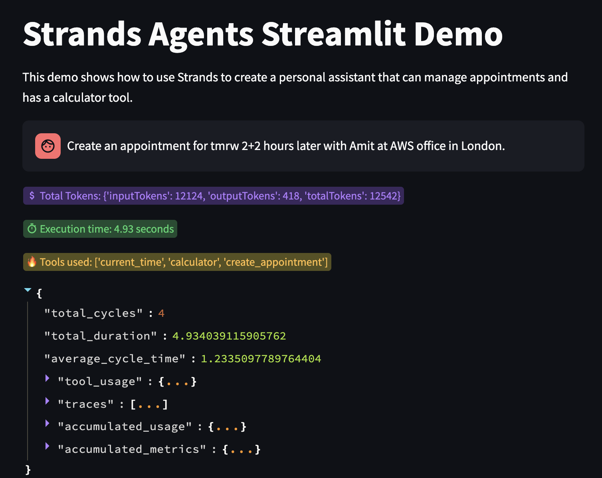
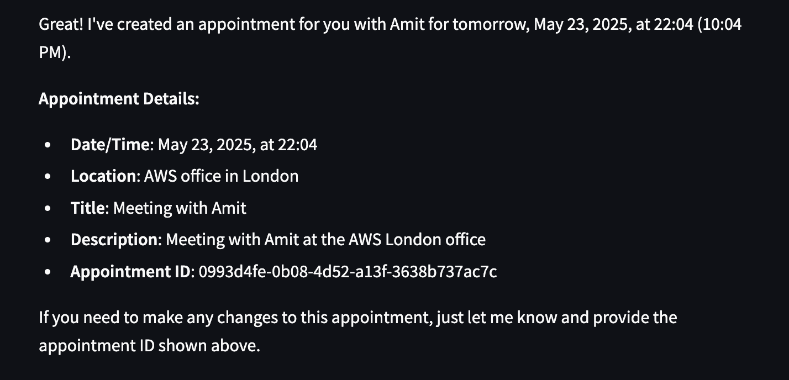

# strands-agents-streamlit

A demo of [Strands Agents](https://strandsagents.com/) in [Streamlit](https://streamlit.io/)

## Prerequisites

* python >= 3.10
* `anthropic.claude-3-7-sonnet` model enabled in Amazon Bedrock in your AWS account
* configure valid AWS credentials in your execution environment

## Run

1. Clone this repo:

```bash
git clone https://github.com/amit-lulla/strands-agents-streamlit.git
```

2. Create a new virtual env and install dependencies:

```bash
python -m venv .venv
source .venv/bin/activate
pip install -r requirements.txt
```

3. Launch the streamlit server:

```bash
streamlit run app.py --server.port 8080
```

4. Try a sample input:

```bash
Create an appointment for tmrw 2+2 hours later with Amit at AWS office in London.
```
This will use 3 tools namely ```['current_time', 'calculator', 'create_appointment']```.

#### Input and execution metrics would be similar to this:


#### Output will be similar to this:


5. Deactivate the virtual env:

```bash
deactivate
```

## Features

An agent created using Strands Agents SDK that uses various tools under ```./tools``` directory and some built-in tools from ```strands-agents-tools``` library. The above example showcases how the agent leverages multiple tools to create an appointment in SQLite DB.

## License

This application is licensed under Apache License 2.0 - See the [LICENSE](LICENSE) file for details.

## Author
[Amit Lulla](https://github.com/amit-lulla)